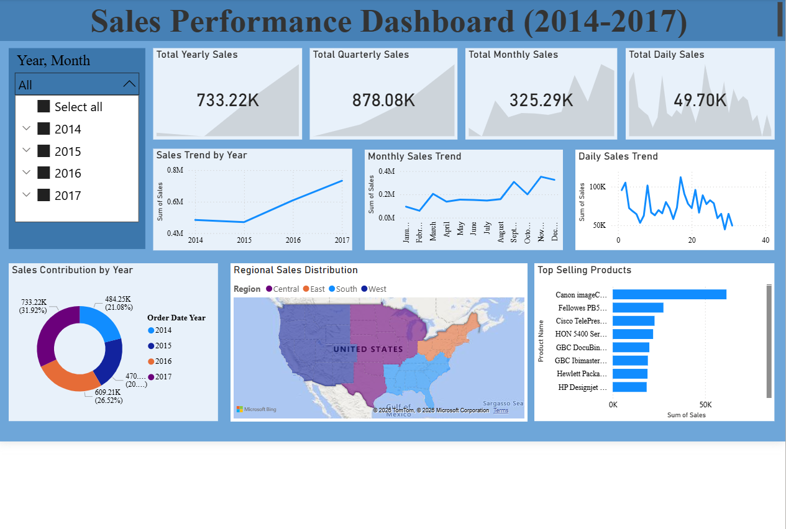

# Power-BI-Project
# 📊 Sales Performance Dashboard (2014–2017)

## 📌 Project Overview

This project presents a **Sales Performance Dashboard** built using **Microsoft Power BI** to analyze sales data from **2014 to 2017**.
The dashboard provides insights into sales trends, regional performance, and top-selling products to support data-driven decision making.

The objective of this project is to transform raw sales data into **interactive visualizations** that help identify patterns and business insights.

---

## 🎯 Objectives

* Analyze overall sales performance between **2014–2017**
* Identify **yearly, monthly, and daily sales trends**
* Understand **regional sales distribution**
* Discover **top-selling products**
* Provide interactive filtering using **slicers**

---

## 📂 Dataset

The dataset used in this project contains historical sales records including:

* Order Date
* Product Name
* Sales
* Profit
* Region
* State
* Customer Details
* Category and Segment

The data was imported into **Power BI Desktop** for analysis and visualization.

---

## 🛠 Tools & Technologies

* **Microsoft Power BI**
* **Microsoft Excel (Dataset Source)**
* **Data Modeling & DAX**
* **Data Visualization Techniques**

---

## 📊 Dashboard Features

### 🔹 Key Performance Indicators (KPIs)

The dashboard highlights the following metrics:

* **Total Yearly Sales**
* **Total Quarterly Sales**
* **Total Monthly Sales**
* **Total Daily Sales**

These KPIs provide a quick overview of business performance.

---

### 📈 Sales Trend Analysis

The dashboard includes multiple trend analyses:

* **Sales Trend by Year**
* **Monthly Sales Trend**
* **Daily Sales Trend**

These visualizations help identify sales growth patterns and seasonal variations.

---

### 🌎 Regional Sales Distribution

A filled map visual displays **sales distribution across different regions and states**, helping identify high-performing geographical areas.

---

### 🏆 Top Selling Products

A bar chart highlights **top-selling products**, allowing businesses to identify products that generate the most revenue.

---

### 🍩 Sales Contribution by Year

A donut chart shows how each year contributes to overall sales performance.

---

## 🔍 Key Insights

* Sales increased steadily from **2014 to 2017**, indicating business growth.
* Certain **regions contribute significantly more sales** compared to others.
* A small number of **top products generate a large portion of revenue**.
* Sales trends show variations across months and days.

---

## 📷 Dashboard Preview

## 🚀 Future Improvements

Possible enhancements for this project include:

* Adding **sales forecasting using machine learning**
* Integrating **real-time sales data**
* Performing **customer segmentation analysis**
* Expanding the dashboard with **profit and category analysis**

---

## 📚 References

* Microsoft Power BI Documentation
* Microsoft Learn – Power BI Learning Resources
* Kaggle datasets for sales analysis

---

## 👨‍💻 Author

**Bhanuteja Samal**

---
